<h1 align="center">
  <a href="https://git.io/typing-svg">" alt="Typing SVG" /></a>
</h1>

⏳ Year progress { ▁▁▁▁▁▁▁▁▁▁▁▁▁▁▁▁▁▁▁▁▁▁▁▁▁▁▁▁▁▁ } 1.64 %
---
⏰ Updated on Tue, 06 Jan 2026 13:00:14 GMT

 

  Hi all, I build backends, write about Social Anthropology and dabble with Linux, LLMs
   
  💻 Conversations on Macro Economics, Finance and Technological Disruptions are welcome!
   
  📚 I’m currently building Cinnamon Desklets, Hyperledger and Privacy Tech
   
  💬 Ask me anything from <a href="https://github.com/NeoZ666/NeoZ666/issues" title="Issues">Here</a>
   
  📫 How to reach me: <a href="mailto:neoz.bitcoin@proton.me">neoz.bitcoin@proton.me</a>

<h2 align="center">🔥 Languages & Frameworks & Tools & Abilities 🔥</h2>
 

  <code></code>
  <code></code>
  <code></code>
  <code></code>
  <code></code>
  <code></code>
  <code></code>
  <code></code>
  <code></code>
  <code></code>
  <code></code>
  <code></code>
  <code></code>
  <code></code>
  <code></code>
  <code></code>
  <code></code>
  <code></code>
  <code></code>
  <code></code>
  <code></code>

<h2 align="center">⚡ Stats ⚡</h2>
 

  
    
  

  
